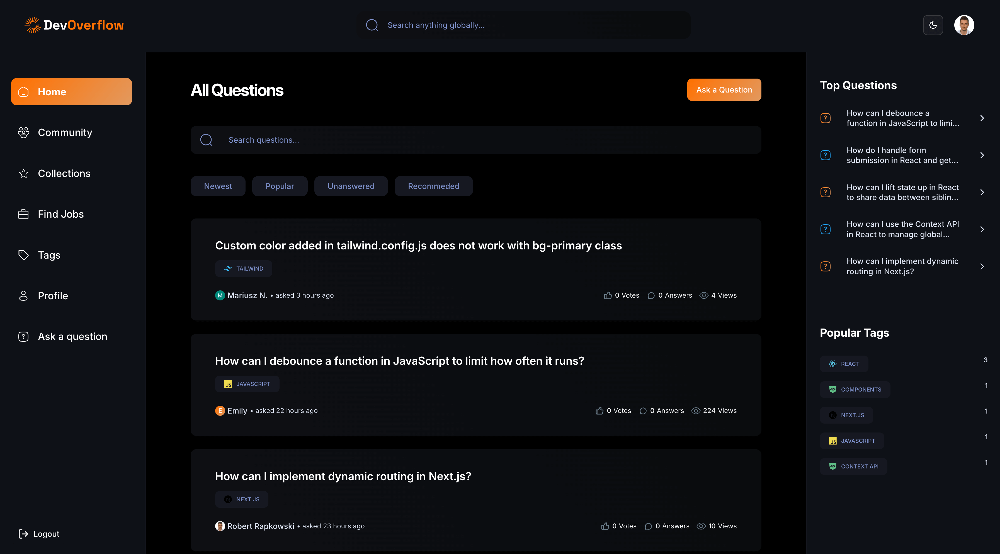
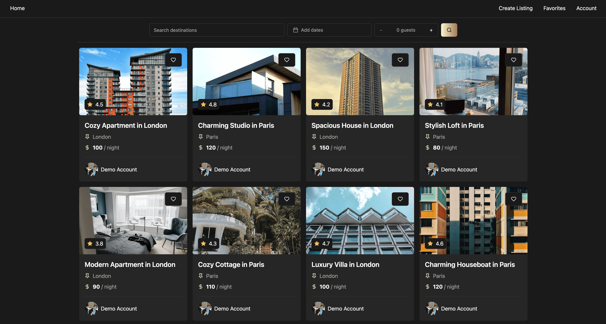
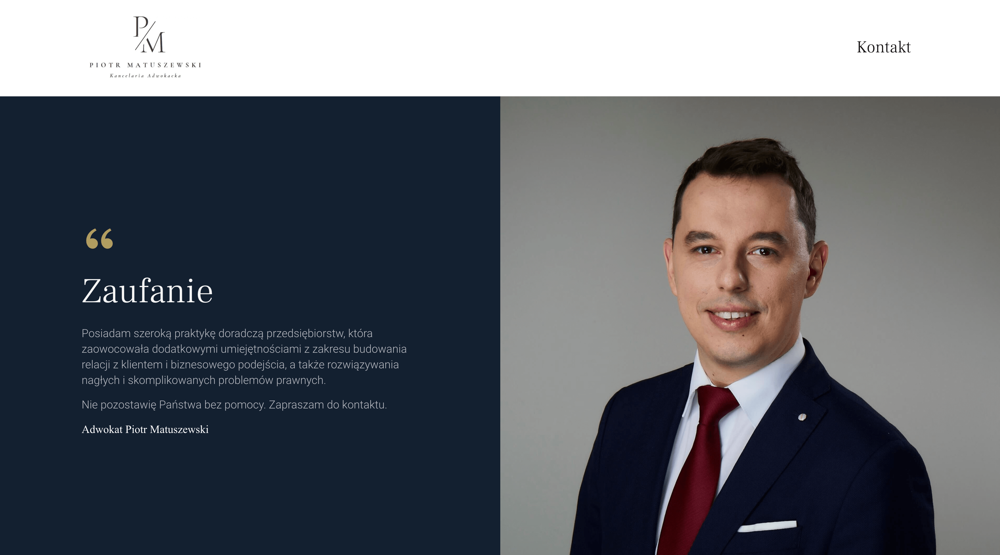
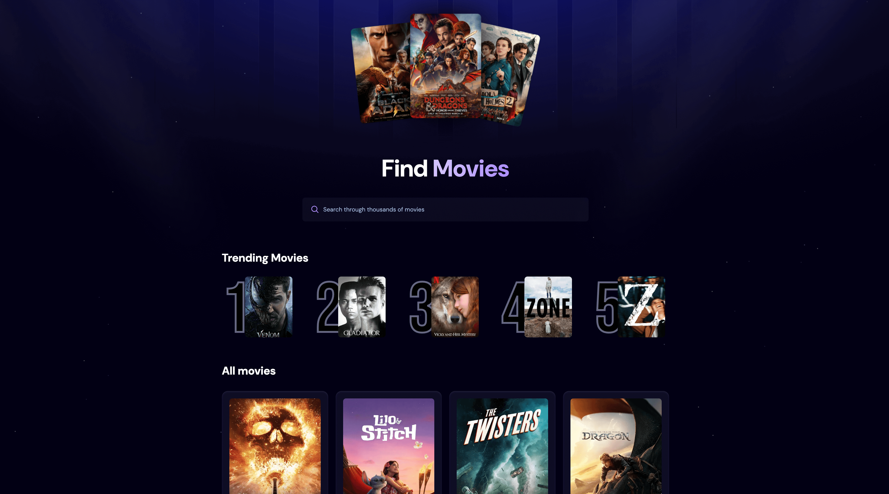

	

<h3>
	
	Hi there
</h3>

	• I am a Front-end developer from Warsaw, Poland 🇵🇱 
	• Over 3 years of commercial experience in front-end development 
	• Over 10 years of overall commercial experience in the international IT
	industry 
	• Passionate about creating modern, fast, and scalable applications and
	websites. 
	• I'm also interested in fullstack development in order to fully understand
	how applications work and to design better solutions.  
	 
	Check out my projects below! 

	
	

 

<h3 align="left">TECH-STACK & SKILLS</h3>

 

<h3 align="left">PORTFOLIO WEBSITE</h3>

	<a href="https://robert-rapkowski-portfolio.vercel.app" target="_blank"
		>Visit my Portfolio</a
	>

	<a
		href="https://github.com/Rapkowsky/robert-rapkowski-portfolio"
		target="_blank"
		>Github repo - see more details</a
	>

 

<!-- --------------------- SECTION BREAK --------------------- -->

<h3 align="left">MY PROJECTS</h3>
 

<!-- --------------------- SECTION BREAK --------------------- -->

## <a> 🖥️&nbsp;&nbsp; DevHub (Fullstack)</a>

 

	

	DevHub is my biggest project to date - it's a full-stack application inspired
	by StackOverflow but enhanced with AI capabilities, creating a comprehensive
	community-driven platform where developers can ask questions, share knowledge,
	and accelerate their journey. This application leverages Next.js
	advanced rendering strategies (SSG, ISR, SSR, PPR, Server Functions, Caching,
	and Revalidation) alongside MongoDB for data storage and NextAuth for
	versatile authentication options including Email/Password, GitHub, and Google.
	With sleek styling provided by TailwindCSS and ShadCN UI, DevHub offers a
	complete ecosystem where users can post questions, provide answers, utilize
	AI-powered responses, vote on contributions, organize content with tags, earn
	badges through gamification elements, discover relevant job opportunities, and
	explore recommended topics.

	<a href="https://devhub-prod.vercel.app" target="_blank"
		>Live demo - see it in action</a
	>

	<a href="https://github.com/Rapkowsky/dev-hub" target="_blank"
		>Github repo - see more details</a
	>

 

	

 

<!-- --------------------- SECTION BREAK --------------------- -->

## <a> 🖥️&nbsp;&nbsp; Zoofy (Fullstack)</a>

 

	

	Zoofy is full-stack web application for managing pets. It features secure
	authentication with NextAuth and user authorization via JWT tokens. Users can
	register, log in, and manage their pets—add, edit, view, or delete them. The
	app also includes integrated payment functionality using Stripe.

	<a href="https://rr-zoofy.vercel.app" target="_blank"
		>Live demo - see it in action</a
	>

	<a href="https://github.com/Rapkowsky/zoofy" target="_blank"
		>Github repo - see more details</a
	>

 

	

 

<!-- --------------------- SECTION BREAK --------------------- -->

## <a> 🖥️&nbsp;&nbsp; R-Booking (Frontend)</a>

 

	

	R-Booking is a web application for browsing and managing rental property
	listings, similar to platforms like Booking.com or Airbnb. The app allows
	users to browse and filter properties, view detailed listings with galleries
	and location info, add favorites, securely authenticate with JWT, read and
	leave reviews with star ratings, and create new rental listings with form
	validation.

	<a href="https://r-booking-project.vercel.app" target="_blank"
		>Live demo - see it in action</a
	>

	<a href="https://github.com/Rapkowsky/r-booking" target="_blank"
		>Github repo - see more details</a
	>

 

	

 

<!-- --------------------- SECTION BREAK --------------------- -->

## <a> 🖥️&nbsp;&nbsp; Adwokat Matuszewski (Frontend)</a>

 

	

	An interactive website featuring a fully functional contact form, allowing
	users to easily submit inquiries or messages directly to the lawyer. This
	feature ensures seamless communication and provides a convenient way for
	potential clients to get in touch with the lawyer for legal assistance or
	consultation.

	<a href="https://www.adwokatmatuszewski.pl" target="_blank"
		>Live demo - see it in action</a
	>

 

	

 

<!-- --------------------- SECTION BREAK --------------------- -->

## <a> 🖥️&nbsp;&nbsp; Movie app (Frontend)</a>

 

	

	A React application styled with Tailwind and powered by Appwrite, featuring a
	dynamic Trending Movies List that showcases the most popular titles based on
	user searches. The search functionality allows users to quickly and accurately
	find movies directly from the database, ensuring an up-to-date and engaging
	browsing experience.

	<a href="https://movie-app-robert-rapkowski.vercel.app" target="_blank"
		>Live demo - see it in action</a
	>

	<a href="https://github.com/Rapkowsky/movie-app" target="_blank"
		>Github repo - see more details</a
	>

 

	

 
