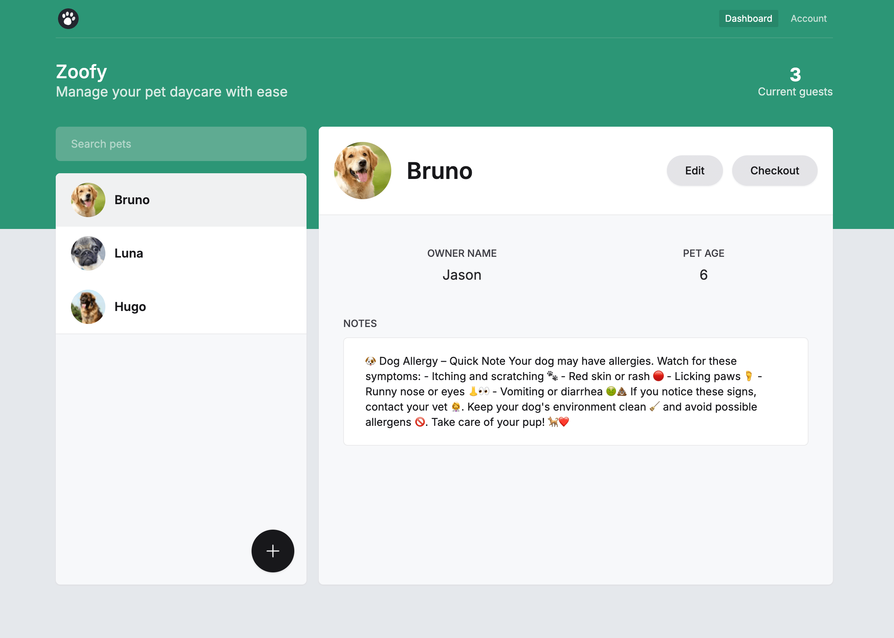

    

<h3 align="center">
    
    Hi there
</h3>

    I am a Front-end developer from Warsaw, Poland 🇵🇱 with over 3 years of
    commercial experience. 
    I am interested in fullstack development to fully understand how
    applications work and to design better solutions.

 

<h3 align="left">TECH-STACK & SKILLS</h3>

 

<h3 align="left">PORTFOLIO WEBSITE</h3>

    <a href="https://robert-rapkowski-portfolio.vercel.app/" target="_blank"
        >Visit my Portfolio</a
    >

    <a
        href="https://github.com/Rapkowsky/robert-rapkowski-portfolio"
        target="_blank"
        >Github repo - see more details</a
    >

 

<!-- --------------------- SECTION BREAK --------------------- -->

<h3 align="left">MY PROJECTS</h3>
 

<!-- --------------------- SECTION BREAK --------------------- -->

<h3 align="left">Zoofy (Fullstack)</h3>

    <a href="https://rr-zoofy.vercel.app" target="_blank"
        >Live demo - see it in action</a
    >

    <a href="https://github.com/Rapkowsky/zoofy" target="_blank"
        >Github repo - see more details</a
    >

    

    

    Zoofy is a web app for managing pets. It features secure authentication with
    NextAuth and user authorization via JWT tokens. Users can register, log in,
    and manage their pets—add, edit, view, or delete them. The app also includes
    integrated payment functionality.

 

<!-- --------------------- SECTION BREAK --------------------- -->

<h3 align="left">R-BOOKING (Frontend)</h3>

    <a href="https://r-booking-project.vercel.app/" target="_blank"
        >Live demo - see it in action</a
    >

    <a href="https://github.com/Rapkowsky/project-react" target="_blank"
        >Github repo - see more details</a
    >

    R-Booking is a web application for browsing and managing rental property
    listings, similar to platforms like Booking.com or Airbnb.

<h4>Used technologies</h4>

    
    
    
    
    

<h4>Core features</h4>
<ul>
    <li>
        Browse Listings: Users can explore available rental properties on the
        homepage.
    </li>
    <li>
        Filter Listings: Offers can be filtered by name, date, and number of
        guests.
    </li>
    <li>
        Listing Details: Clicking on a listing opens a detailed view, including
        a photo gallery, description, location, price, and guest capacity.
    </li>
    <li>
        Manage Favorites: Users can add listings to their favorites and view
        them in a dedicated section.
    </li>
    <li>
        User Authentication: Login system with form validation and JWT handling.
    </li>
    <li>Review System: Users can browse property reviews with star ratings.</li>
    <li>
        Create Listings: Form that allows users to add new rental properties
        with data validation.
    </li>
</ul>
 

<h3 align="left">ADWOKAT MATUSZEWSKI (Frontend)</h3>

    <a href="https://www.adwokatmatuszewski.pl/" target="_blank"
        >Live demo - see it in action</a
    >

    An interactive website featuring a fully functional contact form, allowing
    users to easily submit inquiries or messages directly to the lawyer. This
    feature ensures seamless communication and provides a convenient way for
    potential clients to get in touch with the lawyer for legal assistance or
    consultation.

<h4>Used technologies</h4>

    
    
    
    

<h4>Core features</h4>
<ul>
    <li>
        An interactive website featuring a functional contact form, allowing
        users to easily submit inquiries or messages.
    </li>
</ul>
 
<h3 align="left">MOVIE APP (Frontend)</h3>

    <a href="https://movie-app-robert-rapkowski.vercel.app" target="_blank"
        >Live demo - see it in action</a
    >

    <a href="https://github.com/Rapkowsky/movie-app" target="_blank"
        >Github repo - see more details</a
    >

    The application includes a Trending Movies List that displays the most
    popular movies based on the number of user searches. Additionally, it
    features a robust search functionality, allowing users to quickly and
    accurately fetch movies directly from the database based on their queries.

<h4>Used technologies</h4>

    
    
    

<h4>Core features</h4>
<ul>
    <li>
        Trending Movies List: The application displays a list of trending movies
        based on the number of searches for each movie, keeping users updated
        with the latest and most popular titles.
    </li>
    <li>
        Search and Fetch Movies: Users can search for movies and retrieve them
        directly from the database, ensuring fast and accurate results tailored
        to their queries.
    </li>
</ul>
<h3 align="left">Connect with me</h3>

    
    

